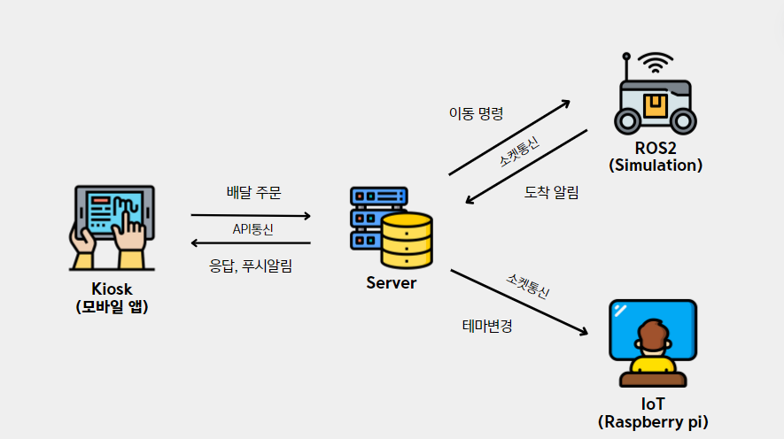
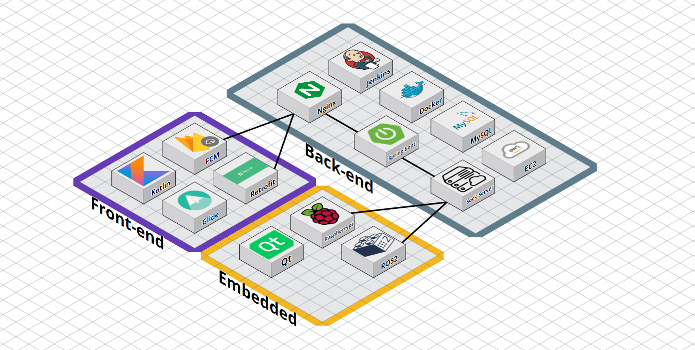
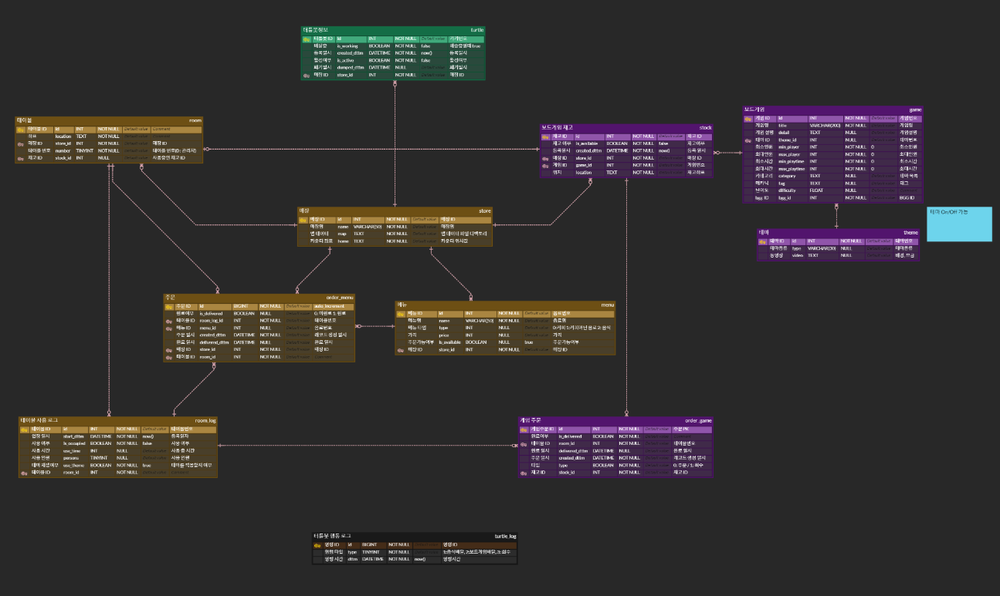
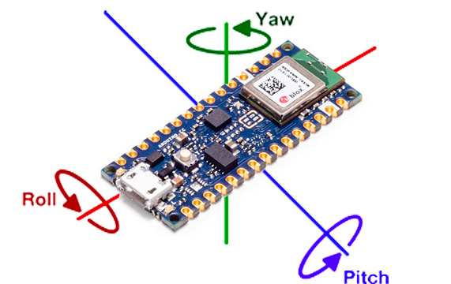
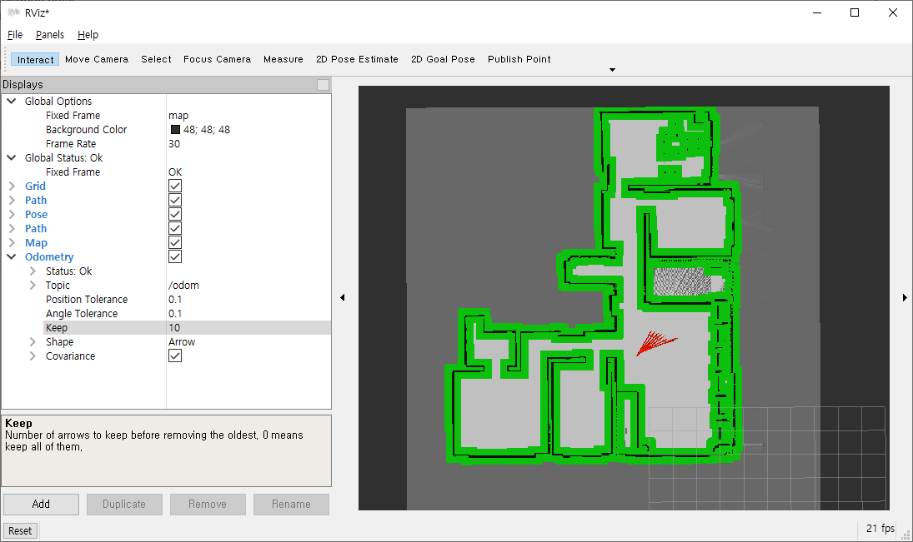
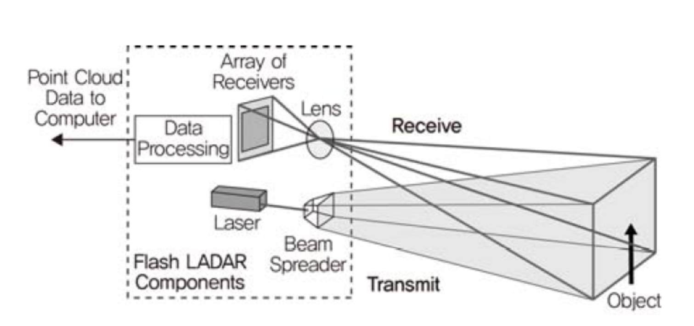
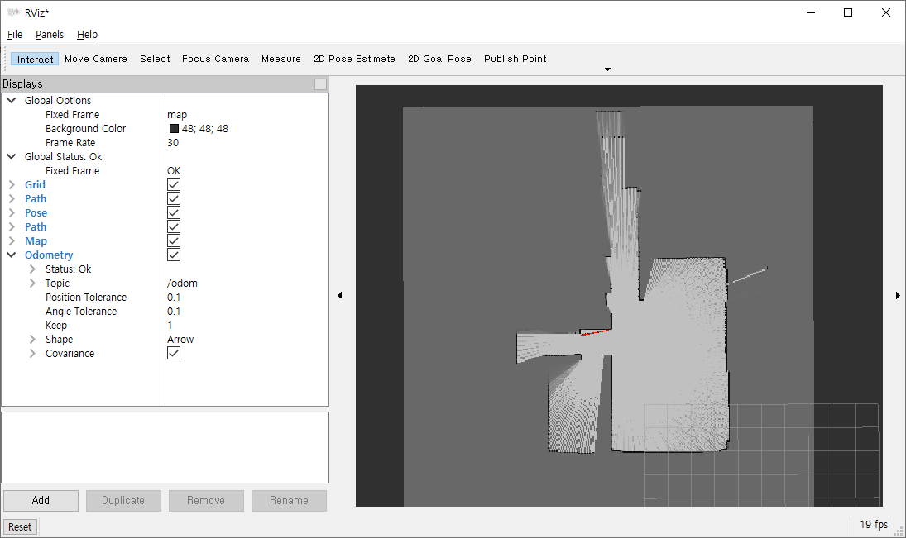
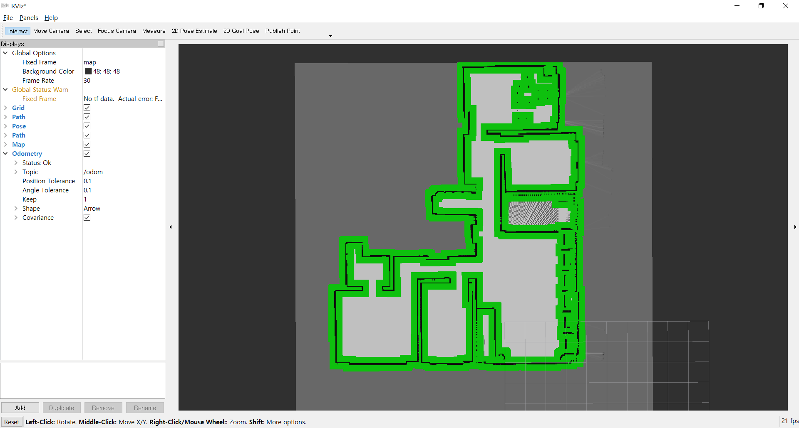
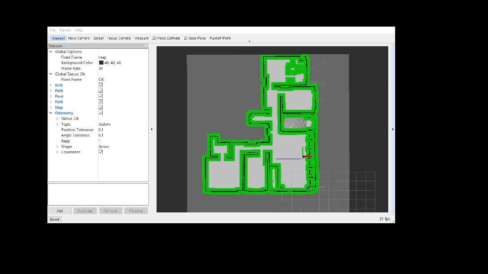

# A210 소현없는 소현팀
- 진행기간: 2024.02.26 ~ 2024.04.04

|팀원소개|||
|:-:|:-:|:-:|
||||
|[박모은(팀장,FE)](https://github.com/moeun12)|[~~신소현(팀장, BE)~~](https://github.com/sheene-sh)|[김준하(BE)](https://github.com/kimjunha1575)|
||||
|[이상협(EM)](https://github.com/Riemanntotoro)|[최성규(EM)](https://github.com/cccl33)|[오동현(EM)](https://github.com/ODong-Dong)|

## 프로젝트 개요

### 기획 배경

- 보드게임방은 다양한 보드게임이 있는 만큼 인원수, 취향에 관계없이 누구나 부담없이 즐길 수 있는 여가이고 많은 수의 보드게임 카페가 창업되고 있습니다.
- 하지만 대부분의 보드게임 카페는 보드게임들이 선반위에 규칙없이 흩어져 있어 고객에게 불편함을 요구하고 추가적인 인력을 요구하는 문제가 있습니다.
    1. 고객이 보드게임을 직접 가지러가야 하는 불편함
    2. 고객이 원하는 보드게임을 찾는데 어려움이 있음.
    3. 재고관리가 뚜렷하게 되지 않기 때문에 다른 룸에서 플레이 중이여서 재고가 없는 경우에도 이를 알 수 없음.
    4. 반납시 원래 위치에 돌려두지 않는 경우가 많아 이를 정리하는데 추가적인 시간, 인력이 필요함.
- 이러한 문제점들이 재고관리 및 보드게임 보관이 체계화 되어있지 않아 발생하는 문제라고 판단하였고, 이번 프로젝트를 통해 재고관리의 DB화, 보드게임 대여/반납의 자동화를 실현하고자 하였습니다.
- 또한, 생동감있는 게임플레이를 위해 보드게임별 테마를 만들어 각 방에 있는 디스플레이와 스피커를 통해 해당 테마를 재생할 수 있습니다. 이는 키오스크를 통해 제어가 가능합니다.

### 주요 기능

- 보드게임 주문, 서빙
- 보드게임 반납
- 보드게임별 테마 적용
- 보드게임 재고 관리
- 서빙 완료 시 푸시알림
- 음료 등 메뉴 주문
- 장바구니
- 음료 서빙
- 튜토리얼
- 방문 손님 별 테마 설정 저장
- 매니저 페이지

## 서비스 설계

### 주요 기술 스택

- BE
    - Spring boot v3.2.3
    - JPA
    - Docker v24.0.5
    - Docker compose v2.24.7
    - Jenkins v2.448
    - FCM
    - Gradle

- FE
    - Kotlin v1.9.22
    - Glide v4.12.0
    - Retrofit2 v2.9.0
    - Coroutines v1.7.1
    - FCM (firebase-bom v32.8.0, firebase-messaging v23.4.1)
    - Safe args v2.7.7

- EM
    - ROS2
    - Qt
    - Raspberry Pi

### 아키텍쳐

### ERD

### ROS

| ROS 주요 Node 설명

* **odometry**
    * **IMU** 센서
        *  가속도와 회전을 측정하여 로봇이나 자동차의 동적 상태를 파악한다. 가속도 센서와 자이로스코프를 포함하여 3차원 공간에서의 운동을 감지한다.       

    * IMU 센서
    * 

    * IMU 센서로부터 얻은 데이터를 통합하여 로봇이나 자동차가 얼마나 이동했는지, 어느 방향으로 회전했는지를 추정한다. 이 과정에서 적분의 개념이 활용되어 정밀한 위치 추정이 가능하다.

    * odometry
    * 
    
* **run_mapping**
    * **Bresenham`s Algorithm**

    * 축 선택 : 시작점과 끝점 사이에서 x 축과 y 축 중 변위가 더 큰 축을 기준으로 선택한다

    * 정수 값 찾기 : 기준 축을 따라 1씩 증가시키면서, 다른 축에서의 값을 결정한다. 이 때, 가장 가까운 정수 값을 찾아 직선을 그린다. 이 과정에서 정수 연산만이 사용된다.

    * LiDAR 센서를 통해 얻은 데이터를 기반으로 mapping을 하는 데에 쓰였다. LiDAR 센서로부터 얻은 각도와 거리 정보를 바탕으로, 맵 상에서 물체 위치를 정확하게 결정하는 데 유용하다.

    * LiDAR 센서
    * 

    * run_mapping
    * 
    
* **load_map**
    * run_mapping 노드를 통해 얻은 맵 정보를 띄우는 노드

    * load_map
    * 
    
* **dijkstra**
    * **dijkstra Algorithm**
        * 그래프에서 한 정점에서 다른 모든 정점으로 가는 최단 경로를 찾는 알고리즘

    * **A_star Algorithm**
        * A* 알고리즘은 시작점에서 목표점까지의 최단 경로를 찾는 그래픅 탐색 알고리즘이다. dijkstra 알고리즘과 유사하지만, 각 정점에 대해 현재 위치에서 목적지까지의 거리(휴리스틱 함수)를 추가로 고려한다.

    * 위 알고리즘을 사용하여 현재 위치에서 목적지까지의 전체 경로 즉, global_path를 생성한다.
    
* **local_path**
    * 현재 위치에서 global_path와 가장 가까운 경로를 찾아 local_path 생성 후 path_tracking에 사용한다.
    
* **path_tracking**
    * LiDAR 센서
        * 빛(레이저)을 이용해 대상과의 거리를 측정한다.

    * 회피 알고리즘
        * 로봇의 전방, 오른쪽, 왼쪽과 대각선에서 LiDAR 센서로 장애물까지의 거리를 측정 후, 로봇의 속도와 각속도를 조정한다.

    * **PID 제어**
        * 목표 거리와 실제 거리의 오차를 기반으로 로봇의 이동 방향과 속도를 조정

        * P : 오차에 비례하여 제어 작용을 생성, 오차가 클수록 더 큰 제어 신호가 생성되어 빠르게 목표값으로 접근하도록 함

        * I : 오차를 시간에 따라 누적, 오랫동안 오차가 존재하면 제어 작용이 점점 크게 증가하여 목표 상태로 정확하게 이동시킴. 적분항이 너무 커지지 않도록 최댓값을 설정하고, 본래의 궤도로 들어왔을 때 0으로 초기화 시키는 작업이 필요

        * D : 현재 오차와 이전 오차의 차이를 계산. 오차의 변화가 급격할 때 더 큰 제어 신호를 생성하며, 오차가 음수일 때 오버슈트(목표값을 초과하는 것)를 방지함

|PID 제어 적용 O|PID 제어 적용 X|
|:-:|:-:|
|||

### 경로 생성 및 tracking 이미지

### 시연

